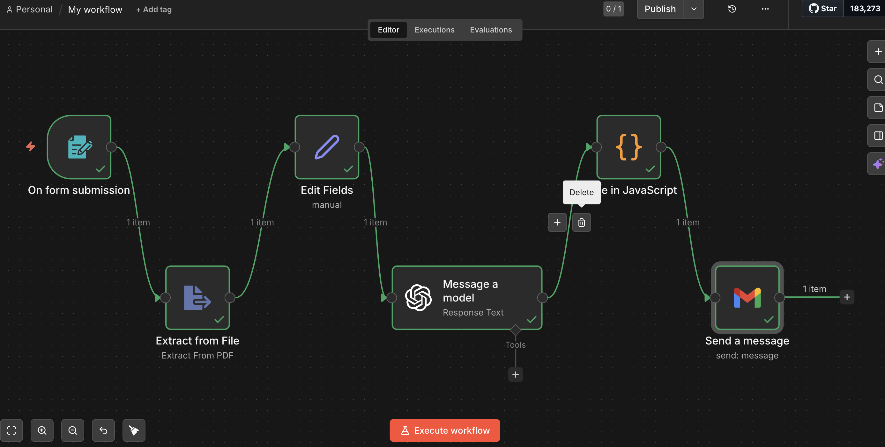
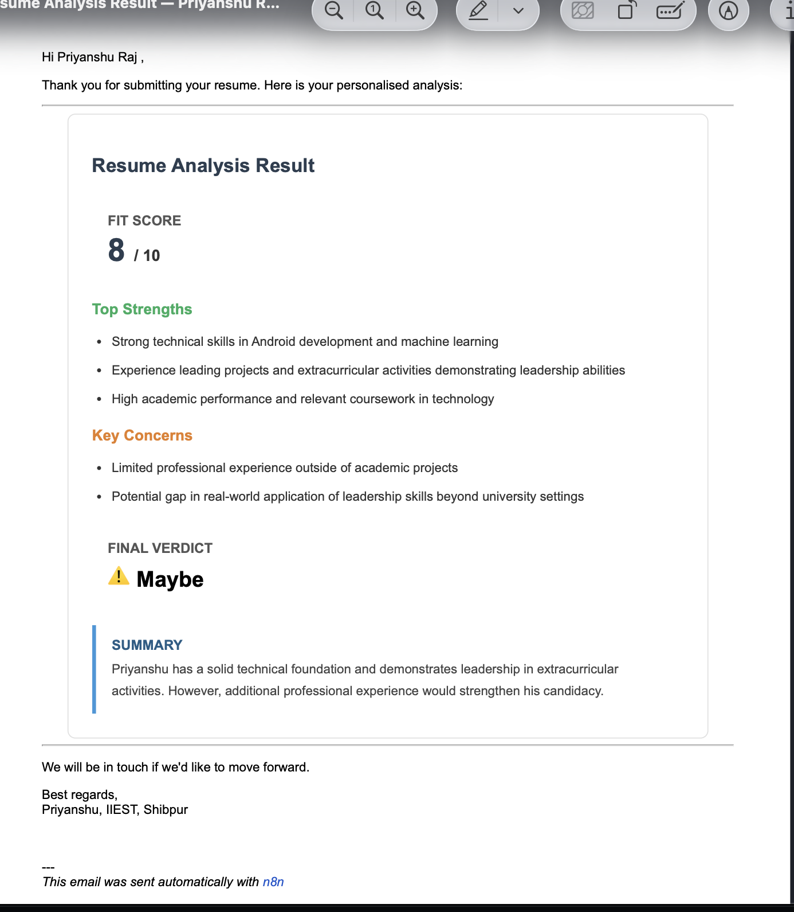

# ResumeIQ
AI-powered resume screening automation built with n8n and OpenAI

# ResumeIQ — AI-Powered Resume Screening Automation

An end-to-end automation pipeline that analyses resumes 
using OpenAI and delivers formatted evaluation reports 
to candidates instantly via email.

## Live Demo
https://raj61.app.n8n.cloud/form/7c365a42-a13c-41fd-83a7-f37fda8fe7d3

_This is the type of permenant link that will be generated. This may not work after free Open AI API credit expires._

## Demo Video
YouTube - https://youtu.be/LVA8YLkgFj0

LinkedIn - https://www.linkedin.com/posts/yespriyanshu_n8n-openai-resume-ugcPost-7448505828871143424-sVar/

## How it works
1. Candidate submits name, email and resume via a public form.
2. PDF is automatically read and text is extracted.
3. OpenAI GPT-4o-mini analyses the resume and generates structured JSON 
4. JavaScript code node parses the JSON and formats it into an HTML email.
5. Candidate receives a personalised evaluation report instantly on the submitted email.

## Screenshots

### Workflow Overview

### Email Output

## Tech Stack
- n8n — workflow automation
- OpenAI GPT-4o-mini — AI resume analysis and JSON generation
- Gmail API — automated email delivery
- JavaScript — JSON parsing and HTML email formatting

## Setup Instructions
1. Import `workflow/resumeiq_workflow.json` into your n8n instance
2. Add your OpenAI API key as a credential
3. Connect your Gmail account as a credential
4. Activate the workflow
5. Copy the Form Trigger URL and share it

## Author
Priyanshu Raj

[LinkedIn](https://www.linkedin.com/in/yespriyanshu)
